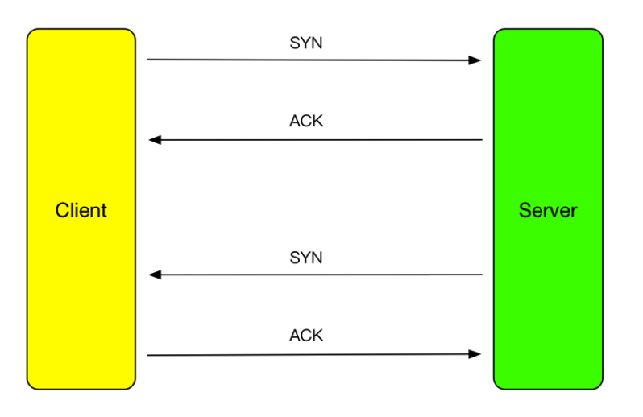
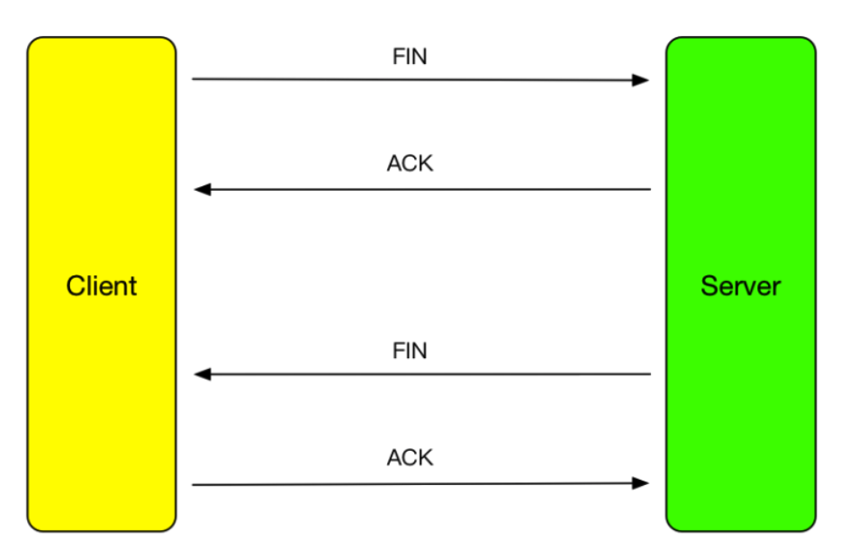

# ReadingNotes

###[Hacking Hit Tests](http://khanlou.com/2018/09/hacking-hit-tests/)

-pointInside:withEvent: 给定的点是否在当前视图中

-hitTest:withEvent:返回响应的视图

-convert:from: 转换坐标系

三个方法搭配使用，可以控制视图响应

###[Early returning functions in Swift](https://www.swiftbysundell.com/posts/early-returning-functions-in-swift)

用guard控制函数提前返回。

###[TCP没那么难吧？](https://mp.weixin.qq.com/s/zRelB6uSz07YaCoJoggZZA)

TCP是双向的，可靠的通讯，所以连接就必须确认双方到对方的通讯都是可靠的
SYN表示synchronize，在建立连接时使用；ACK表示acknowledge，表示确认收到了消息，FIN表示finish，在断开连接时使用

