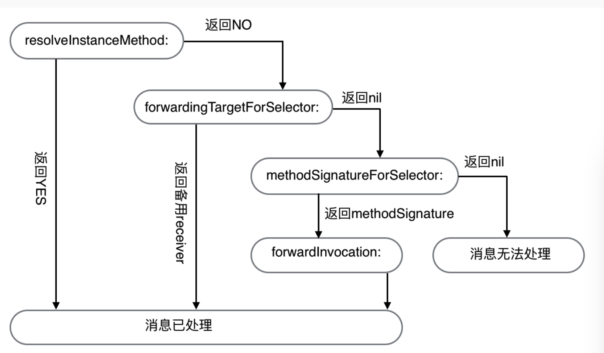

##算法
###[时间复杂度和空间复杂度的简单讲解](https://blog.csdn.net/halotrriger/article/details/78994122)
时间复杂度：
时间复杂度的计算并不是计算程序具体的运行时间，而是算法执行语句的次数。当我们面对多个算法时，我们可以通过计算时间复杂度，判断出哪一个算法在具体执行时花费时间最多和最少。

计算方法：
1.选取相对增长最高的项
2.最高项系数都化为1
3.若是常熟的话用O(1)表示
如f(n) = 2*n^3 + 2n + 100则O(n) = n^3

时间复杂度的计算：
1.如果算法执行时间不随着问题规模n的增加而增大，即使算法中有上千条语句，其执行时间也不过是一个较大的常数，此类算法的时间复杂度是O(1)
2.当有若干个循环语句时，算法的时间复杂度是由嵌套层数最多的循环语句中最内层语句的频度f(n)决定的。
3.循环不仅与n有关，海域执行循环所满足的判断条件有关

空间复杂度：
空间复杂度是对一个算法在运行过程中临时占用存储空间大小的度量

计算方法：
1.忽略常数，用O(1)表示
2.递归算法的空间复杂度=递归深度N*每次递归所要的辅助空间
3.对于单线程来说，递归有运行时堆栈，求的是递归最深的那一次压栈所消耗的空间的个数，因为递归最深的那一次所消耗的空间足以容纳他所有递归过程

##操作系统
###[iOS Memory Deep Dive](https://www.jianshu.com/p/dad9f27e412e)
现代操作系统的内存管理   虚拟内存（VM）是一些技术的总称，包括硬件异常，主存，磁盘文件，操作系统内核软件的内存管理。

虚拟内存提供了三大重要的特性
1.他将主存看作存储在磁盘上的地址空间的高速缓存，利用程序的局部性原理，只将活跃的内存加载到主存中，提高了主存的利用率。
2.为每个进程提高了一个抽象的统一的连续的私有的第一空间。简化了内存管理方式。
3.对内测进行分段提供权限能力，保护每个进程的地址空间不会被其他进程影响。

寻址方式
在一些早期的操作系统和一些嵌入式操作系统中，内存管理使用的地址是物理地址，现在操作系统基本使用的是虚拟地址的寻址方式，使用虚拟地址时CPU将VA送到MMU（Memory Management Unit 内存管理单元一般是一个CPU上的专用芯片，是一个硬件。）中去翻译为物理地址。

地址空间
通常来说地址空间是线性的 假设我们有{0,1,2,..N-1}个内存地址，我们可以用n位二进制来表示内存地址，那么我们就叫这个地址空间为n位地址空间。

分页
现在操作系统将内存划分为页，来简化内存管理，一个页其实就是一段连续的内存地址的集合。
操作系统将虚拟页和物理页的映射关系称为业表（PT），每个映射叫页表条目（PTE），操作系统为每个进程提供一个页表放在主页中，CPU在使用虚拟地址时交给MMU去翻译地址，MMU去查询在主存中的页表来翻译。

缺页处理
1.未分配的不用多说代表未使用的内存
2.缓存的代表已经加载进物理内存了
3.未缓存的代表还没放在物理内存

当CPU要读区一个页时，检查标记发现当前的页时未缓存的，会触发一个缺页中断，这时内核，，操作系统的缺页异常处理程序，去选择一个牺牲页（有时候内存够用不用置换别的届面），然后检查这个页面是否有修改，有修改先写会磁盘，然后将需要使用的内存加载到物理内存中，然后更新PTE随后操作系统重新把虚拟地址发送到地址翻译硬件去重新处理。

注：有些操作系统无虚拟内存置换逻辑，如iOS，取而代之的是内存压缩，和收到内存警告时杀死进程的行为。

虚拟内存带来的好处：
1.简化链接过程
2.简化加载
3.简化共享
4.内存保护

地址翻译：
现代操作系统将地址分为两部分，页号和片，由于虚拟页和物理页的大小是相通的，页偏移可以看作虚拟页和物理页的页内地址，且相同页号则作为PT的索引查找到对应的PTE，然后查找对应的物理页地址。

提高效率
计算机的世界所有的难题哦度可以同加一次的办法来解决，所以现代操作系统通常都使用多级页表，减少业表项的个数。将虚拟地址分为多端，代表了一级二级多级页表。通过多级页表可以大大减少内存占用。

MMU芯片内置一个翻译后备缓冲器（TLB）的硬件来充当缓存，加快地址翻译的效率。

现代OS虚拟内存操作系统：
操作系统为每个进程维护一个单独的虚拟地址空间，分为两部分：
1.内核虚拟内存，包含内核中的代码和数据结构，还有一些被映射到所有进程共享的内存页面。还有一些页表，内核在进程上下文中执行代码使用的栈。
2.进程虚拟内存。OS将内存组织为一些区域的集合，代码端，数据端，共享库端，线程栈都是不同的区域，分段的原因是便于管理内存的权限，如果了解过Mach-O文件或者ELF文件的读者可以看到相通的Segment里面的内存权限是相通的，每个segment在划分不同内容的section

内存映射MMAP
类Unix操作系统可以映射一个普通磁盘上的文件的连续部分到一个固定的内存存取区域，操作系统会自动管理映射的内容。

MMAP在iOS中的用处
1.mmap让读写一个文件像操作一个内存地址一样简单方便，
2.mmap效率极高，不用将一个内容从磁盘读入内核态在拷贝至用户态
3.mmap映射的文件由操作系统接管，如果进程crash操作系统会保证文件刷新回磁盘

动态内存分配
虽然可以使用上面的低级API去映射内存，但是需要动态申请内存用来做变量处理的时候就需要动态内存分配器。

####iOS的虚拟内存
iOS内存的分页大小
在arm64之后的芯片，操作系统通常使用16kb作为页大小，我们写的程序中的虚拟内存地址右移动14位则可以得到页编号。MMU通过TLB和固定在内存进程虚拟区域的页表来翻译物理地址。

页面的类型
当操作系统分配一个页面时，内存被称为Clean的，以为这个内存页面没有使用，是可以被释放或者重建的，但是一旦写入，操作系统回将其标记为dirty，这意味着磁盘或者其他地方没有次内存页面的备份，无法恢复它。

由于iPhone设备为了减少闪存的寿命，并没有在闪存上使用交换分区，因此无论是用多少，在内存压力高紧时，操作系统不会将dirty写好磁盘，而是释放clean的页面。

iOS内存的优化
在其他常见的操作系统上，由于局部性原理，os会将不常用的内存页面写会磁盘，但是iOS没有交换空间，取而代之的是内存压缩技术，iOS将不常用到的dirty页面压缩以减少页面占用量。再次访问到的时候重新解压缩。

iOS上常用的swift，oc，c,c++都适用显示的内存管理策略

###[操作系统是如何管理内存的](http://limboy.me/tech/2018/09/14/os-memory.html)
每个进程创建的内存地址都是虚拟地址，操作系统使用了虚拟化技术，让进程觉得它拥有了大块可支配的内存的假象，操作系统拿到这个地址后会将它转变为真实的内存地址，从而拿到对应的信息。

##iOS基础
###[揭秘iOS布局](https://sq.163yun.com/blog/article/200743376636538880)
一个iOS应用的主runloop负责处理所有的用户输入事件并触发响应的响应。所有的用户交互都会被加入到一个时间队列中。下图中的Application object会从队列中取出事件并将他们分发到应用中的其他对象上。本质上它会解释这些来自用户的输入事件，然后调用在应用中的Core object相应的处理代码，而这些代码再调用开发者写的代码。当这些方法调用返回后，控制流回到主runloop上，然后开始update cycle（更新周期）。update cycle 负责布局并且重新渲染试图

uodate cycle是当应用完成了你的所有事件处理代码后控制流回到主runloop是的那个时间点

layoutSubviews()
这个UIView方法处理对视图及其所有子视图的重新定位和大小调整。
可以在runloop的不同时间点触发layoutSubview调用的机制，这些触发机制比直接调用layoutsubview的资源消耗要小得多。
当layoutsubview完成后，在view的所有者viewcontroller上，会触发viewDidLayoutSubviews调用，因为viewDidLayoutSubviews是view布局更新后被唯一可靠调用的方法，所以应该把所有依赖于布局或者大小的代码方法viewDidLayoutSubviews中，而不是放在viewDidLoad或者viewDidAppear中。这是避免使用过时的布局或者位置变量的唯一方法

setNeedsLayout()
触发layoutSubview调用的最省资源的方法就是在你的视图上调用setNeedsLayout方法。调用这个方法代表向系统表示视图的布局需要重新计算。

layoutIfNeeded()
layoutIfNeeded是另一个会让UIView触发layoutSubview的方法。当视图需要更新的时候，与setNeedsLayout()会让视图在下一个周期调用layoutSubview更新视图不同，layoutIfNeeded会立即调用layoutSubview。

显示
一个视图的现实包含了颜色，文本，图片和CoreGraphics绘制等视图属性，不包括其本身和子视图的大小和位置。和布局的方法类似，显示也有出发更新的方法，他们由系统在检测到更新时自动调用，或者我们可以手动调用直接刷新。

draw(_:)
类似于视图布局的layoutsubview，但是不同于layoutsubview，draw方法不会出发后续对视图的子视图方法的调用。同样，和layoutsubview一样，你不应该直接调用draw方法，而应该通过触发方法，让系统在runloop中的不同节点自动调用。

setNeedsDisplay()
类似于布局中的setNeedsLayout。它会给有内容更新的视图设置一个内部的标记，但在视图重绘之前就会返回。

约束
自动布局包含三步来布局和重绘视图。第一步是更新约束，系统会计算并给视图设置所有要求的约束，第二部是布局阶段，布局引擎计算视图和子视图的frame并且将它们布局。最后一步完成这一循环的就是显示阶段，重绘视图的内容，如实现了draw方法。

updateConstraints()
这个方法用来在自动布局中动态改变视图约束。

setNeedsUpdateConstraints()
调用setNeedsUpdateConstraints()会保证在下一次更新周公其中更新约束。

updateConstraintsIfNeeded()
如果他认为这些约束需要被更新，它会立即触发uodateContraints(),而不会等到runloop的末尾

invalidateIntrinsicContentSize()
自动布局中某些视图拥有intrinsicContentSize属性，这是视图根据他的内容得到的自然尺寸。一个视图的intrinsicContentSize通常由所包含的元素的约束决定，但也可以通过重载提供自定义行为。调用invalidateIntrinsicContentSize()会设置一个标记表示这个视图的intrinsicContentSize已经过期，需要在下一个布局阶段重新计算。

###[质量监控-卡顿检测](https://juejin.im/post/5bb09795f265da0ac84946e0)
instruments与性能
在开发阶段，使用内置的性能工具instruments来检测性能问题。
CPU用于执行程序指令，针对代码的处理逻辑，GPU用于大量的计算，针对图像信息的渲染。正常情况下，CPU会周期性的提交要渲染的图像信息给GPU处理，保证视图的更新，一旦其中之一响应不过来，就会表现为卡顿。因此多数情况下用到的工具是检测GPU负载的Core Animation，以及检测CPU处理效率的Time Profiler

会影响到CPU性能的诱因包括以下：
1.发生在住线程的I/O任务
2.过多的线程抢占CPU资源
3.温度多高导致的CPU降频

影响GPU的因素：
1.显存频率
2.渲染算法
3.大计算量

卡顿检测：
1.执行耗时任务会导致CPU短时间无法响应其他任务，检测任务耗时来判断是否可能导致卡顿
2.由于卡顿直接表现为操作无响应，洁面动画迟缓，检测主线程是否能响应任务来判断是否卡顿

fps
通常情况下，屏幕会保持60hz/s的刷新速度，每次刷新时会发出一个屏幕刷新信号，CADdisplayLink允许我们注册一个与刷新信号同步的回调处理。可以通过屏幕刷新机制来展示fps

ping
ping是一种常用的网络测试工具，用来测试数据包是否能到达ip地址。在卡顿发生的时候，主线程会出现短时间内无响应这一表现，基于ping的思路从子线程尝试通讯主线程来获取主线程的卡顿延时

runloop
作为和主线程相关的最后一个方案，基于runloop的校测和fps的方案非常相似，都需要依赖于主线程的runloop。由于runloop会调用同步刷新的callback，如果loop的间隔大于16.67ms，fps自然达不到60hz。而在一个loop当中存在多个阶段，可以监控每一个阶段停留多长时间

stack backtrace
代码质量不够好的方法可能会在一段时间内持续占用CPU的资源，换句话说在一段时间内，调用栈总是停留在执行某个地址指令的状态。由于函数调用会发生入栈行为，如果比对两次调用栈的符号信息，前者是后者的符号子集时，可以认为出现了卡顿。

msgSend observe
OC方法的调用最终转换成msgSend的调用执行，通过在函数前后插入自定义的函数调用，维护一个函数栈结构可以获取每一个OC方法的调用耗时，以此进行性能分析和优化

###[驴妈妈客户端频道页模块化设计思路 - 2018.10.01第六版](https://juejin.im/post/5bad0632f265da0ab41e62fe)

频道页模块化后上述提到的元素分别位于哪一层

###[iOS RunLoop入门小结](http://www.cocoachina.com/ios/20180515/23380.html)
iOS 系统中，提供了两种RunLoop：NSRunLoop 和 CFRunLoopRef。
CFRunLoopRef 是在 CoreFoundation 框架内的，它提供了纯 C 函数的 API，所有这些 API 都是线程安全的。

NSRunLoop 是基于 CFRunLoopRef 的封装，提供了面向对象的 API，但是这些 API 不是线程安全的

①.RunLoop是寄生于线程的消息循环机制，它能保证线程存活，而不是线性执行完任务就消亡。

②.RunLoop与线程是一一对应的，每个线程只有唯一与之对应的一个RunLoop。我们不能创建RunLoop，只能在当前线程当中获取线程对应的RunLoop（主线程RunLoop除外）。

③.子线程默认没有RunLoop，需要我们去主动开启，但是主线程是自动开启了RunLoop的。

④.RunLoop想要正常启用需要运行在添加了事件源的Mode下。

⑤.RunLoop有三种启动方式run、runUntilDate:(NSDate *)limitDate、runMode:(NSString *)mode beforeDate:(NSDate *)limitDate。第一种无条件永远运行RunLoop并且无法停止，线程永远存在。第二种会在时间到后退出RunLoop，同样无法主动停止RunLoop。前两种都是在NSDefaultRunLoopMode模式下运行。第三种可以选定运行模式，并且在时间到后或者触发了非Timer的事件后退出。

###[ARC到底帮我们做了哪些工作？](https://blog.csdn.net/wangyanchang21/article/details/79461511)
ARC是编译时编译器插入了原本需要自己手写的内存管理代码，而非像垃圾回收一样运行时的垃圾回收系统。

绝对不分ARC都是可以做好的，但会有一些情况是例外的，如performSelector系列方法有很多，都是带有选择子的，这种编程方式极为灵活，经常可用来简化复杂的代码，不管哪种用法，编译器都不知道要执行的选择子是什么，这必须到了运行期才能确定。

###[Effective OC之内存管理](https://blog.csdn.net/wangyanchang21/article/details/79356164#t7)
在ARC中，所有与引用计数有关的方法都无法编译，所以在开启ARC功能时不能直接调用的内存管理的方法。

引用计数机制通过可以递增递减的计数器来管理内存。对象创建好之后，其保留计数至少为1，若保留计数为正，则对象继续存活，当保留计数为0时，对象就被销毁了
在对象生命期中，其余对象通过引用来保留或者释放此对象。保留与释放操作分别会递增及递减保留计数。

###[深入简出--iOS编程思想](http://www.cocoachina.com/ios/20180928/25053.html)
####1.面向过程编程思想
处理事情以过程为核心，一步一步的实现
####2.面向对象编程思想
万物皆对象
####3.连式编程思想
是将多个操作（多行代码）通过点号（.）链接在一起成为一句代码，是代码可读性好。
####4.响应式编程思想
不需要考虑调用顺序，只需要知道考虑结果，类似于蝴蝶效应，产生一个事件，会影响很多东西，这些东西像流一样的传播出去，然后影响结果。

KVO的实现原理：
当观察某对象A时，KVO机制动态创建一个对象A当前对象类的子类，并为这个新的子类充血了被观察属性keyPath的setter方法，setter方法随后负责通知观察对象属性的改变状况
####5.函数式编程思想
是把操作尽量写成一系列嵌套的函数或者方法调用。

###[打造开源第一iOS图片浏览器](https://www.jianshu.com/p/bffdb9f0036c)
这篇文章主要讲述YBImageBrowser的一些功能技术细节，代码架构思路，设计模式选择等。
[源码](https://github.com/indulgeIn/YBImageBrowser)

###[面向对象设计的六大设计原则](https://knightsj.github.io/2018/09/09/面向对象设计的六大设计原则（附%20Demo%20及%20UML%20类图）/#more)

开闭原则：一个软件实体如类、模块和函数应该对扩展开放，对修改关闭

为了更好的实践开闭原则，在设计之初就要想清楚在该场景里那些数据（或行为）是一定不变（或很难再改变）的，那些是很容易变动的。将后者抽象成接口或抽象方法，以便在将来通过创造具体的实现应对不同的需求

单一职责原则：一个类只允许有一个职责，即只有一个导致该类变更的原因。

在实际开发中，我们需要将不同的职责分开

依赖倒置原则：即，依赖抽象，而不是依赖实现；抽象不应该依赖细节，细节应该依赖抽象，高层模块不能依赖底层模块，二者都应该依赖抽象

今后在处理高低层模块（类）交互的情景时，尽量将二者的依赖通过抽象的方式解除掉，实现方式可以是通过接口也可以是抽象类的方式

接口分离原则：多个特定的客户端接口要好于一个通用性的总接口

在设计接口时，尤其是在向现有的接口添加方法时，我们需要仔细斟酌这些方法是否是处理同一类任务的，如果是则可以放在一起，如果不是则需要做拆分。

迪米特法则：一个对象应该对尽可能少的对象有接触，也就是只接触那些真正需要接触的对象。

今后在做对象与对象之间交互的设计时，应该极力避免引出中间对象的情况（需要倒入其他对象类）：需要什么对象直接返回即可，降低类之间的耦合度

里氏替代原则：所有引用基类的地方必须能透明地使用其子类的对象，也就是说子类对象可以替换其父类对象，而程序执行效果不变。

里氏替换原则是对继承关系的一种检验：检验是否真正符合继承关系，以避免继承的滥用。因此，在使用继承之前，需要反复思考和确认该继承关系是否正确，或者当前的继承体系是否还可以支持后续的需求变更，如果无法支持，则需要及时重构，采用更好的方式来设计程序。

###[iOS APP后台Crash调查](http://mrpeak.cn/blog/ios-background-running/)

已知的iOS App后台运行场景有：
background task 通常情况下，app一旦进入后台，只有数秒的时间继续执行代码，之后就会被系统suspend。除非app显示的调用beginBackgroundTaskWithExpirationHandler API,能延迟App在后台运行代码的时间，iOS7 之前10分钟，iOS7之后缩减至3分钟，一旦时间期限到，系统依旧会suspend进程

background mode 开启这种模式的app可以一直在后台运行

background fetch在系统指定的时间段唤醒app并执行少量逻辑的机制，限制较多

silent push 这是通过apn里设置特定字段来唤醒app的机制，限制较多

pushkit 是用来替代VOIP后台运行模式的新机制，在收到语音或者视频电话时，可以通过pushkit的通知来唤醒app，从而避免app在后台一直运行。

已知的至少有这几类crash是无法被app捕获的：

*前台主线程卡死，app被watchdog强杀

*app在前台或者后台使用过多的内存，被系统强杀，分别为foom和boom

*app在后台被suspend之后，由于违反apple的某个policy，而被系统强杀。

###[保护App不闪退](http://www.cocoachina.com/ios/20180919/24905.html)
由于OC是Message机制，而且对象在转换的时候，回有拿到的对象和预期不一致，所以会有方法找不到的情况，在找不到方法时，查找方法将会静如方法Forward流程，系统给了三次补救的机会。

resolveInstanceMethod:(SEL)sel 这是实例化方法没有找到方法，最先执行的函数，首先回流转到这里，返回值是BOOL，没有找到就是NO，找到就返回YES，如果要解决就需要在当前的事例中加入不存在的Selector，并绑定IMP。

如果resolveInstanceMethod没有处理，将进行到forwardingTargetForSelector这步来，这时候你可以返回nil, 你也可以用一个Stub对象来接住，把消息流程转到Stub，然后在你的Stub里添加不存在的Selector，这样就不会crash。

当methodSignatureForSelector返回nil时，会Crash
如果methodSignatureForSelector返回一个定义好的NSMethodSignature，但是没有实现forwardInvocation，也会闪退，如果实现了forwardInvocation，会先返回到resolveInstanceMethod然后再才会到forwardInvocation
当流转到forwardInvocation,通过以下方法:
[anInvocation invokeWithTarget:xxxtarget1];
[anInvocation invokeWithTarget:xxxtarget2];

###[Hacking Hit Tests](http://khanlou.com/2018/09/hacking-hit-tests/)

-pointInside:withEvent: 给定的点是否在当前视图中

-hitTest:withEvent:返回响应的视图

-convert:from: 转换坐标系

三个方法搭配使用，可以控制视图响应

###[Early returning functions in Swift](https://www.swiftbysundell.com/posts/early-returning-functions-in-swift)

用guard控制函数提前返回。

###[TCP没那么难吧？](https://mp.weixin.qq.com/s/zRelB6uSz07YaCoJoggZZA)

TCP是双向的，可靠的通讯，所以连接就必须确认双方到对方的通讯都是可靠的
SYN表示synchronize，在建立连接时使用；ACK表示acknowledge，表示确认收到了消息，FIN表示finish，在断开连接时使用

###[iOS启动时间优化](http://www.zoomfeng.com/blog/launch-time.html)

####pre-main阶段
影响因素：
动态库加载越多，启动越慢。
ObjC类越多，函数越多，启动越慢。
可执行文件越大启动越慢。
C的constructor函数越多，启动越慢。
C++静态对象越多，启动越慢。
ObjC的+load越多，启动越慢。
优化：
①减少依赖不必要的库，不管是动态库还是静态库；如果可以的话，把动态库改造成静态库；
如果必须依赖动态库，则把多个非系统的动态库合并成一个动态库；
②检查下 framework应当设为optional和required，
如果该framework在当前App支持的所有iOS系统版本都存在，那么就设为required，否则就设为optional，
因为optional会有些额外的检查； 
③合并或者删减一些OC类和函数；
关于清理项目中没用到的类，使用工具AppCode代码检查功能，查到当前项目中没有用到的类（也可以用根据linkmap文件来分析，但是准确度不算很高）；
有一个叫做[FUI](https://github.com/dblock/fui)的开源项目能很好的分析出不再使用的类，准确率非常高，唯一的问题是它处理不了动态库和静态库里提供的类，也处理不了C++的类模板。
④删减一些无用的静态变量，
⑤删减没有被调用到或者已经废弃的方法，
方法见http://stackoverflow.com/questions/35233564/how-to-find-unused-code-in-xcode-7
和https://developer.Apple.com/library/ios/documentation/ToolsLanguages/Conceptual/Xcode_Overview/CheckingCodeCoverage.html。
⑥将不必须在+load方法中做的事情延迟到+initialize中，尽量不要用C++虚函数(创建虚函数表有开销)
⑦类和方法名不要太长：iOS每个类和方法名都在__cstring段里都存了相应的字符串值，所以类和方法名的长短也是对可执行文件大小是有影响的；
因还是object-c的动态特性，因为需要通过类/方法名反射找到这个类/方法进行调用，object-c对象模型会把类/方法名字符串都保存下来；
⑧用dispatch_once()代替所有的 attribute((constructor)) 函数、C++静态对象初始化、ObjC的+load函数；
⑨在设计师可接受的范围内压缩图片的大小，会有意外收获。
压缩图片为什么能加快启动速度呢？因为启动的时候大大小小的图片加载个十来二十个是很正常的，
图片小了，IO操作量就小了，启动当然就会快了，比较靠谱的压缩算法是TinyPNG。

####main阶段
①减少启动初始化的流程，能懒加载的就懒加载，能放后台初始化的就放后台，
能够延时初始化的就延时，不要卡主线程的启动时间，已经下线的业务直接删掉； 
②优化代码逻辑，去除一些非必要的逻辑和代码，减少每个流程所消耗的时间； 
③启动阶段使用多线程来进行初始化，把CPU的性能尽量发挥出来； 
④使用纯代码而不是xib或者storyboard来进行UI框架的搭建，尤其是主UI框架比如TabBarController这种，
尽量避免使用xib和storyboard，因为xib和storyboard也还是要解析成代码来渲染页面，多了一些步骤；

###[动态界面：DSL&布局引擎](https://awhisper.github.io/2017/05/01/DSLandLayoutEngine/)
DSL是Domain Specific Language的缩写，意思就是特定领域下的语言。

###[谈谈DSL以及DSL的应用（以CocoaPods为例）](https://draveness.me/dsl)
GPL是General Purpose Language，即通用编程语言

###[从数据流角度管窥Moya的实现（一）：构建请求](https://mp.weixin.qq.com/s?__biz=MzA5NzMwODI0MA==&mid=2647759707&idx=1&sn=216ce50d0df1a87ae522fb608c679363&chksm=8887e064bff06972a67a055e89fd5918d1029368ef52de37e7565608d57e93368f3cfb7945d8&scene=21#wechat_redirect)
target -> endpoint -> request -> 回调

###[从数据流角度管窥Moya的实现（二）：处理相应](https://mp.weixin.qq.com/s?__biz=MzA5NzMwODI0MA==&mid=2647759751&idx=1&sn=685471017b5655cce360e761534ff78a&chksm=8887e0b8bff069ae01ee885962fe03018c4205fc94e3cb4bfcfe1dbbd28c6cf06917e0e4b2d1&scene=21#wechat_redirect)
response -> result -> 回调

###[移动应用架构演变及泛前段趋势下移动团队破局](https://mp.weixin.qq.com/s/iHehLneIYibWq6IRjuefxg)
第二类石那些异构开发方案， 在大趋势下未来3-5年入锅还继续做移动端技术，rn/weex/flutter三个里面从底层到应用至少要精通一个，PWA可关注。第三类是垂直领域的技术，比如像图像处理，AR/VR，音视频编解码流媒体，浏览器内核，阅读排版引擎，复杂动效，更高级的UI绘制。第四类是周边运维，包括对项目的定制化构建，持续集成，性能监控，代码规范审查自动化，自动化测试。

如何规划未来要做什么：
1。跟随行业热点趋势，就是那些短期内聚集开发者关注的技术，简单的筛选方式是通过GitHub trending挖掘
2.从公司的需求，技术痛点

###[WWDC 2018: iOS内存深入研究](https://juejin.im/post/5b23dafee51d4558e03cbf4f)
+为什么要减少内存使用
可以有更好的用户体验，更快的启动速度，不会因为内存过大而导致crash，可以让APP存活更久

+内存占用
内存是由系统管理的，一般以页为单位划分，在iOS上，每一页包含16kb的空间。一段数据可能回占用多页内存，所占用也总数乘以每页空间得到的就是这段数据使用的总内存

+分析内存占用工具
+图像
+在后台时，对内存优化

###[iOS如何优雅的处理“回调地狱callbackhell”(-)——使用PromiseKit](https://www.jianshu.com/p/f060cfd52f17)
一.PromiseKit简介
PromiseKit是iOS/OS X中一个用来处理异步编程框架。
在PromiseKit中，最重要的一个概念就是Promise的概念的，Promise是异步操作后的future的一个值。
promise也是一个包装着异步操作的一个对象。使用PromiseKit，能够编写出整洁，有序，逻辑简单的的代码，将Promise作为参数，模块化的从一个异步任务到下一个异步任务中去。

PromiseKit就是用来干净整洁的代码，来解决异步操作，和奇怪的错误处理回调的。他将异步操作变成了链式的调用，简单的错误处理方式

PromiseKit里面目前有2个类，一个是Promise<T>(Swift),一个是AnyPromise(Objective-C)，2者的区别就在凉后再难过语言的特征上，Promise<T>是定义精确严格的，AnyPromise是定义宽松，灵活，动态的

二。Promise的使用

三。PromiseKit的源码解析
在异步操作我们可以通过不断的返回promise，传递给后面的then来形成链式调用，所以重点就在then的实现

一个promise可能有三种状态：等待（pending），已完成（fulfilled），已拒绝（rejected）
一个promise的状态只可能从“等待”转到“完成”或者“拒绝”态，不能逆向转换，同时“完成”和“拒绝”不能相互转换
promise必须实现then方法（可以说，then就是promise的核心），而且then必须返回一个promise，同时一个promise的then可以调用多次，并且回调的执行顺序跟他们被定义时的顺序一致
then方法接受两个参数，第一个参数是成功时的回调，在promise由“等待”态转换到“完成”态时调用，另一个是失败时的回调，在promise由“等待”态转换为“”拒绝
态时调用。同时，then可以接受另一个promise传入，也接受一个“类then”的对象或方法，即thenable对象

###[使用asdk性能调优-提升iOS界面的渲染性能](https://draveness.me/asdk-rendering)
iOS中的性能问题大多是阻塞主线程导致用户的交互反馈出现可以感知的延迟
三大原因：
1.UI渲染需要时间较长，无法按时提交结果
2.一些需要密集计算的处理放在了主线程中执行，导致主线程被阻塞，无法渲染UI界面
3.网络请求由于网络状态的问题相应较慢，UI层由于没有模型返回无法渲染

屏幕是如何渲染的？
crt(阴极射线显示管)显示器是比较古老的技术，他使用阴极电子枪发射电子，在阴极高压的作用下，电子由电子枪射向荧光屏，使荧光粉发光，将图像显示在屏幕上，这也就是用磁铁靠近一些老式电视机的屏幕会让他们变色的原因。
而fps就是crt显示器的刷新频率，电子枪每秒会对显示器上内容进行60-100次的刷新，哪怕在我们看来没有任何改变。

但是lcd的原理与crt非常不同，lcd的成像原理跟光学有光：
1.在不加电压下，光线会沿着液晶分子的间隙前进旋转90度，所以光可以通过
2.在加入电压之后，光沿着液晶分子的间隙直线前进，被滤光板挡住

lcd的成像原理虽然与crt截然不同，每一个像素的颜色可以在需要改变时才去改变电压，也就是不需要刷新频率，但是由于一些历史原因，lcd仍然需要按照一定的刷新频率向gpu获取新的图片用于显示

宽泛的说，大多数的CALayer的属性都是由GPU来绘制的，比如图片的圆角，变换，应用纹理；但是过多的几何结构，重绘，离屏绘制以及过大的图片都会导致gpu的性能明显降低

AsyncDisplayKit（ASDK）是由Facebook开源的一个iOS框架，能够帮助最复杂的UI界面保持流畅和快速响应，他更像是对uikit的重新实现，把整个UIkit以及calayer层封装成一个一个node，将昂贵的渲染，图片解码，布局以及其他UI操作移除主线程，这样主线程就可以对用户的操作及时作出反应
在ASDK中最基本的单位就是ASDisplayNode，每一个node都是对UIView以及CALayer的抽象，但是与UIView不同的是，ASDisplayNode是线程安全的，他可以在后台线程中完成初始化以及配置工作。

ASDK的渲染过程
在ASDK中的渲染围绕ASDisplayNode进行，其过程总共有四条主线：
1.初始化ASDisplayNode对应的UIView或者CALayer
2.在当前视图进入视图层级时执行setNeedsDisplay
3.display方法执行时，向后台线程派发绘制事务
4.注册成为runloop观察者，在每个runloop结束时回调

如果ASDisplayNode是layerBacked的，他不会渲染对应的UIView以此来提升性能，因为UIView和CALayer虽然都可以用于展示内容，不过由于UIView可以用于处理用户的交互，所以如果不需要使用UIview的特性，直接使用CALayer进行渲染，能够节省大量的渲染时间

ASDK对于绘制过程的优化有三部分：分别是栅格化视图、绘制图像以及绘制文字
他拦截了视图加入层级翻出的通知-willMOveToWindow:方法，然后手动调用-setNeedsDisplay,强制所有的CALayer执行-display更行内容
然后将上面的操作全部抛入了后台的并发线程中，并在runloop中注册回调，在每次runloop结束时，对已经完成的事务进行-commit，以图片的形式直接穿回对应的layer.content中，完成对内容的更新。
从他的实现来看，确实解决了很多昂贵的cpu以及gpu操作，有效的加快了视图的绘制和渲染，保证了主线程的流畅执行

###[iOS中的JS](https://zhuanlan.zhihu.com/p/34646281)

JSCore的原理和通讯机制
浏览器内核的模块主要是有渲染引擎和JS引擎组成，其中JSCore就是一种JS引擎

JSVirtualMachine js的虚拟机，js运行以来的所有资源提供者
JSContext js的运行环境上下文，用于在native和js间进行数据的传递
JSvalue js的值对象，标记js原始数据类型，双方数据类型转换的桥梁
JSManagedValue 对象管理器，用于处理对象的生命周期
JSExport 接口导出协议，让Native对象直接暴露给JS调用
JSBase.h/JSContextRef.h/JSObjectRef.h。。。。 类，用于C语言的结构

在native应用中我们可以开启多个线程来一步之行我们的不同需求，也就意味着我们可创建多个JSVirtualMachine虚拟机（运行资源提供者），同时相互隔离不影响，这样我们就可以并行执行不同的js任务

在一个jsvirtualMachine中还可以关联多个JSContext（js执行环境上下文），并通过jsvalue（值对象）来和native进行数据传递通讯，同时可以通过jsExport（协议），将native中遵守此解析的类的方法和属性转化为js的接口供其调用

JSPatch
JSPatch是一个Ios动态更新框架，通过引入JSCore，就可以使用js调用任何原生接口，可以为项目动态更新模块，替换原声带吗动态修复bug，也即js传递字符串给oc，oc通过runtime接口调用和替换oc方法

##其他
xib的原理就是将xml文件解析出来，找到相应的view，转换成代码，然后创建对象并显示。

nib的生命周期：
1.将nib文件加载入内存
2.“解固化”并实例化出nib文件里对应的对象
这个过程会调用initWithCoder:方法，注意不会再屌用initWithFrame:方法，步骤1虽然将nib加载到了内存，但是他还是“数据”的形式，而这一步吧步骤一中的“数据”变成了“对象”
3.建立connections(outlets,actions)
4.调用awakeFromNib方法
该函数只会在绑定xib的类中调用，不会在他的File's Owner及其内部的object类中调用
5.将xib中可见的控件显示出来

xib,storyboard都属于资源文件，而不是源文件。

内存泄漏：堆空间没有释放
野指针：栈指向的堆空间已经释放了

.Type表示的是某个类型的元类型，而在Swift中，除了class，struct和enum这三个类型外，我们还可以定义protocol。对于protocol来说，有时候我们呢也会想取得接口的元类型。这时我们可以在某个protocol的明智后面使用.Protocol来获取，使用的方法和.Type是类似的

async 表示该函数内部包含异步操作，需要将它交给内置执行器
await表示等待异步操作的实际结果

macos开发中applicationDidFinishLaunching中可以做一些应用启动前的初始化处理。
应用退出前可以在applicationWillTerminate中做一些全局性数据区/内存/资源的清理释放。

####并行与并发
并行：多个cpu实例或者多台机器同时执行一段处理逻辑，是正真的同时
并发：通过cpu调度算法，让用户看上去同时执行，实际上从cpu操作层面不是正真的同时。并发往往在场景中有公用的资源。
线程安全：经常用来描述一段代码，指在并发的情况下，该代码经过多线程使用，线程的调度顺序不影响任何结果。这个时候使用多线程，我们只需要关注系统的内存，cpu是不是够用即可。反过来，线程不安全就意味着线程的调度顺序会影响最终的结果
同步：Java中的同步指的是通过认为的控制和调度，保证共享资源的多线程访问成为线程安全，来保证结果的准确。
多线程：指的是这个程序（一个进程）运行时产生了不止一个线程
